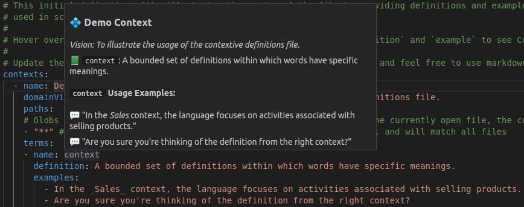
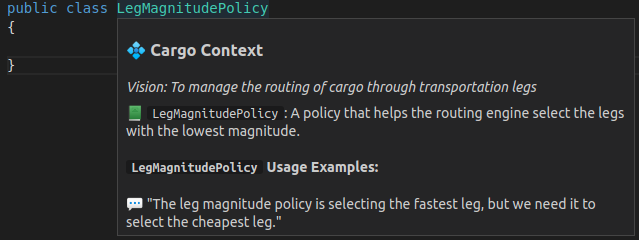

# Contextive README

[](https://github.com/dev-cycles/contextive/actions/workflows/contextive.yml) [](https://twitter.com/intent/follow?screen_name=contextive_tech)

Contextive is a Visual Studio Code extension to assist developers in environments with a complex domain or project specific language, where words have a special meaning in the context of the project.

It should help new team members get up to speed more quickly in understanding domain-specific terms. By storing the term definitions in your repository, and surfacing the definitions as you work on the code, it encourages the use of the domain-specific terms in your code, and regularly updating the definitions as the team's understanding evolves.


## Getting Started

Use the `Contextive: Initialize Definitions` command from the command palette to create a sample definitions file. A file will be created and opened with a sample set of definitions:



This sample file illustrates the use of Contextive by defining the terms used in the definitions file yml structure itself.  You can hover over the name of the terms in the file to see Contextive in action (see the sample image above).

You should delete the sample definitions and replace them with your own.

## Philosophy

Contextive is inspired by the concept of the [Ubiquitous Language](https://martinfowler.com/bliki/UbiquitousLanguage.html) from the practice of [Domain Driven Design (DDD)](https://martinfowler.com/bliki/DomainDrivenDesign.html) and should support ubiquitous language management practices on DDD projects.

Even if you're not using Domain Driven Design, Contextive should still be very helpful in any software project where it's important that developers are aligned on the meaning of terms.

## Features

* Initialize your Contextive Definitions
* Auto-complete from your Contextive Definitions
* Hover to show definitions from your Contextive Definitions
* Support for multiple contexts in the same repository (identified by path globs)
* Currently configured to work in files of type: c, cpp, csharp, fsharp, go, groovy, html, java, javascript, javascriptreact, json, jsonc, markdown, perl, php, plaintext, powershell, python, ruby, rust, sql, typescript, typescriptreact, vb, xml, yaml
* Support for word identification in combined usage such as camelCase, PascalCase and snake_case
* Support for documenting combined words (e.g. verbNoun or noun_verbed)
* Shows definitions in auto-complete details

### Examples

In the following sections, examples are drawn from the Cargo domain, as explored by [Eric Evans](https://twitter.com/ericevans0) in his seminal work on DDD - [Domain Driven Design: Tackling Complexity in the Heart of Software](https://www.dddcommunity.org/book/evans_2003/).

The usage examples are quoted or inspired by sample conversations in the book - ideally, your usage examples should be exact sentences as said by your domain experts.

The following Contextive definitions file was used to generate all screenshots/scenarios below:

```
contexts:
  - name: Cargo
    domainVisionStatement: To manage the routing of cargo through transportation legs
    paths:
    - CargoDemo
    terms:
    - name: Cargo
      definition: A unit of transportation that needs moving and delivery to its delivery location.
      examples:
        - Multiple Customers are involved with a Cargo, each playing a different role.
        - The Cargo delivery goal is specified.
    - name: Leg
      definition: The movement of a Cargo on a specific vessel from load location to unload location.
      examples:
        - Operations will need to contract handling work based on the expected times for each leg
        - For each leg we'd like to see the vessel voyage, the load and unload location, and time.
    - name: Policy
      definition: A set of rules that the routing service must follow when evaluating legs that confirm to the desired routing specification.
      examples:
        - We need to configure the set of policies that will apply for a specific customer.
    - name: LegMagnitudePolicy
      definition: A policy that helps the routing engine select the legs with the lowest magnitude.
      examples:
        - The leg magnitude policy is selecting the fastest leg, but we need it to select the cheapest leg.
  - name: Billing
    domainVisionStatement: Compute and levy charges for shipping
    paths:
    - BillingDemo
    terms:
    - name: Policy
      definition: A set of payment rules that defines when invoices are due, and actions to take when unpaid.
      examples:
        - The billing policy is to send to collections after 90 days in arrears.
```

### Multiple Contexts

For projects utilising a [monorepo](https://en.wikipedia.org/wiki/Monorepo) it's not uncommon to have code relating to multiple [bounded contexts](https://martinfowler.com/bliki/BoundedContext.html) in the same repository.  At this time, Contextive tracks all definitions in the same file.  Each context has a `paths` property that defines a list of path [globs](https://en.wikipedia.org/wiki/Glob_(programming)).  When working on a file, any context with a matching path glob will be evaluated when finding matches for hover and auto-complete.

This is particularly helpful if the same term (e.g. a common term, like `client`, or `invoice`) is used in multiple contexts.  The definition in each context can relate specifically to its usage in that context.

Each context has optional properties `name` and `domainVisionStatement`.  When set, these names and vision statements will be included in the hover panel.

Given the definitions file above, and a folder structure like so:

```
/CargoDemo
  /LegPolicy.cs
/BillingDemo
  /Policy.cs
```

Contextive will match the files to the path glob configurations.

When hovering over `CargoDemo/LegPolicy.cs` we get:


When hovering over `BillingDemo/Policy.cs` we get:


### Combined Words

For the hover display, Contextive is able to identify the use of defined terms in combined words - where terms are combined using `camelCase`, `PascalCase` or `snake_case`, or defined terms that _are_ combined words.

##### Suffixes and Prefixes

It's quite common to combine a term from your language, such as `cargo` with a suffix such as `Id` (or `service`, or `factory`, etc.).  If your code includes `cargoId`, `CargoId` or `cargo_id`, Contextive will identify the defined term `cargo` and display the definition and usage examples:


##### Combining two (or more) terms

It's also common to end up with code elements (classes, variables or methods) that combine two or more terms from your language, such as `Leg` and `Policy`.  Even if you haven't explicitly created a term for `LegPolicy`, Contextive will identify both words and show you both definitions at the same time:


##### Combined words as a single term

Sometimes, the combined term needs its own unique definition - just add it to your definitions file, and Contextive will work out that the more precise match is the one you want, decluttering your hover panel.  

It can be added to your definitions file as either separate words (e.g. `Leg Magnitude Policy`) or as `PascalCase` or `camelCase` (e.g. `LegMagnitudePolicy`).  Either way, once it's defined, the definitions of `Leg` and `Policy` will no longer be shown:



This also now works for `snake_case` code:


### Smart Auto-Complete

As the terms added to the auto-complete are from a definitions file, not from your code symbols, the auto-complete will work in any file of any language - including documentation, such as markdown.

To ensure it's useful in a variety of scenarios, it includes a number of options to fit your required format:

* camelCase
* PascalCase
* snake_case
* UPPER_CASE

The auto-complete options will adjust as you type - e.g. after typing a single lower-case letter, only `camelCase` and `snake_case` will be included.  After typing a single upper case letter, `PascalCase` and `UPPER_CASE` will be included.  After typing two upper case letters, single word, snake_case and combined words will all be in `UPPERCASE`.


#### Coming Soon

* UI to edit/manage Contextive Definitions
* Internationalization support
* Support for multiple contexts in separate repositories
* Configurable list of language identifiers. The list is currently hard coded as above.
* Better support for key word identification in different languages (e.g. different syntax delimiters)
* Support for detecting plural or singular versions of terms

## Extension Settings

This extension contributes the following settings:

* `contextive.path`: The path of the file that stores the Contextive definitions.  Default: `.contextive/definitions.yml`

## Known Issues

* The extension only activates on the presence of the `.contextive` folder in the workspace.  If the `contextive.path` setting has been updated, the `.contextive` folder may not exist.  (The extension will also activate on use of the `Contextive: Initialize Definitions` command.)